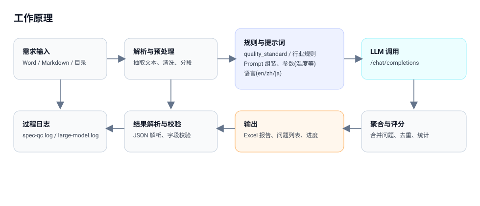

# Work Principle

Key points:

- Requirement inputs (Word/Markdown/folders) are parsed, cleaned, and chunked first
- Each chunk is combined with rules/prompts and sent to the LLM, requiring structured JSON output
- The returned results are parsed and validated, then aggregated into reports (e.g., Excel), with key logs recorded for troubleshooting
