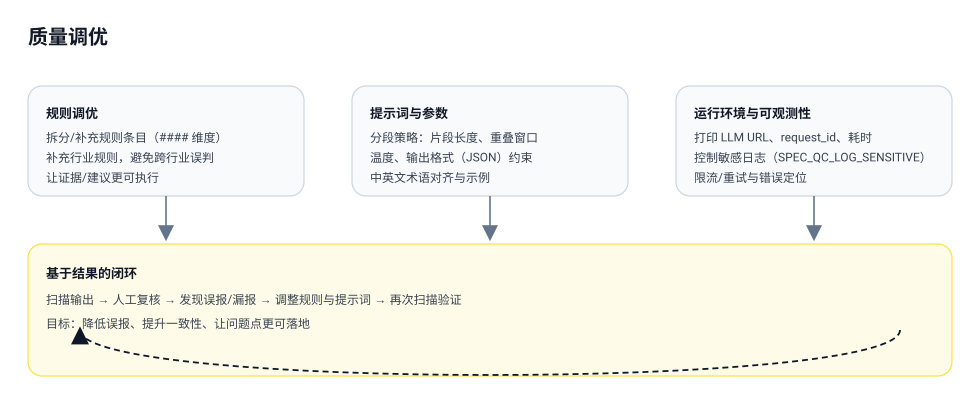

# 质量调优

要点：

- 规则调优：拆分/补充规则条目，补充行业规则，减少误报与跨行业误判
- 提示词与参数：分段策略、输出格式约束、示例与术语对齐，提升一致性与可执行性
- 闭环迭代：扫描输出 → 人工复核 → 调整规则/提示词 → 再扫描验证

## 增加行业规则（建议）

- 在 `work/quality` 下新增行业规则文件（示例：`banking_quality_standard.md`），并在文件开头声明适用行业（如：`适用行业：银行/金融`），避免跨行业误判
- 规则内容建议按质量维度分组（例如用 `####` 作为维度标题），每条规则包含问题描述/反例/解决方案/收益/应用场景，便于模型稳定命中
- 新增或调整规则后，建议用一组历史样本文档做回归扫描，对高频误报点进行“拒绝原因 → 规则调整”的闭环迭代
